# iSchedule

iSchedule é um aplicativo de agendamento de tarefas desenvolvido com React Native. O objetivo do app é fornecer uma interface simples e intuitiva para listar, adicionar, editar, apagar e marcar tarefas como concluídas, com armazenamento local usando AsyncStorage.

## Funcionalidades

- Listagem de tarefas agendadas e concluídas.
- Adicionar, editar e remover tarefas.
- Marcar tarefas como concluídas.
- Persistência de dados local com AsyncStorage.
- Interface responsiva e estilizada com React Native Paper.
- Suporte a temas claro e escuro.
- Suporte a internacionalização com i18next.
- Notificações de status utilizando Toast Messages.

## Estrutura do Projeto

A estrutura do projeto está organizada da seguinte forma:

- **`src/`**: Código-fonte do aplicativo.
  - **`assets/`**: Imagens, ícones e outros recursos estáticos.
  - **`components/`**: Componentes reutilizáveis, como BottomSheet e Modal.
  - **`screens/`**: Telas principais do aplicativo, como tarefas agendadas e concluídas.
  - **`services/`**: Serviços para manipulação de dados e persistência com AsyncStorage.
  - **`hooks/`**: Hooks personalizados para encapsular lógica de estado e operações.
  - **`utils/`**: Funções utilitárias e constantes.
  - **`navigation/`**: Configuração de navegação, incluindo o Bottom Navigator.
  - **`context/`**: Gerenciamento de estado global via Context API.
  - **`types/`**: Definições de tipos TypeScript.

## Bibliotecas Utilizadas

- **React Native**: Framework para desenvolvimento de aplicativos móveis.
- **React Navigation**: Biblioteca para navegação entre telas.
- **React Native Bottom Sheet**: Criação de bottom sheets interativos.
- **AsyncStorage**: Armazenamento local de dados.
- **TypeScript**: Superset de JavaScript com tipagem estática.
- **React Native Paper**: Componentes UI prontos e consistentes.
- **Styled-components**: Estilização com suporte a temas dinâmicos.
- **i18next & react-i18next**: Internacionalização e suporte a múltiplos idiomas.
- **React Native Localize**: Gerenciamento de localização.
- **Moment.js**: Manipulação de datas e horários.
- **React Native Toast Message**: Exibição de notificações Toast.

## Comandos Disponíveis

- **`yarn android`**: Executa o aplicativo em um emulador ou dispositivo Android.
- **`yarn ios`**: Executa o aplicativo em um simulador iOS.
- **`yarn lint`**: Executa o linting do código para detectar problemas de formatação.
- **`yarn start`**: Inicia o servidor de desenvolvimento React Native.
- **`yarn test`**: Executa os testes automatizados com Jest.

## Configuração Inicial

1. **Instalar Dependências**:

   Após clonar o repositório, execute o seguinte comando para instalar as dependências do projeto:

   ```bash
   yarn install
   ```

2. **Configuração do Ambiente**:

   Certifique-se de ter o JDK e Android SDK configurados corretamente, além de outras variáveis de ambiente necessárias.

3. **Executar o Aplicativo**:

   Para rodar o aplicativo em um dispositivo ou emulador Android, execute:

   ```bash
   yarn android
   ```

   Para rodar no simulador iOS, use:

   ```bash
   yarn ios
   ```

## Prints e Gravação do Aplicativo

Abaixo estão capturas de tela e vídeo do iSchedule que ilustram o funcionamento e a interface do aplicativo:

<details>

  <summary>Ver capturas de tela</summary>

  <p float="left">
    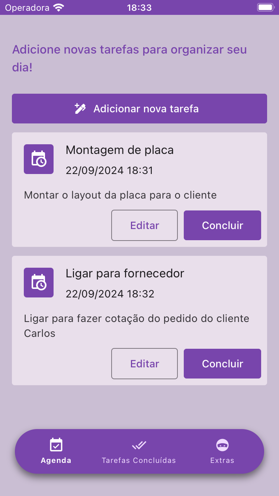
    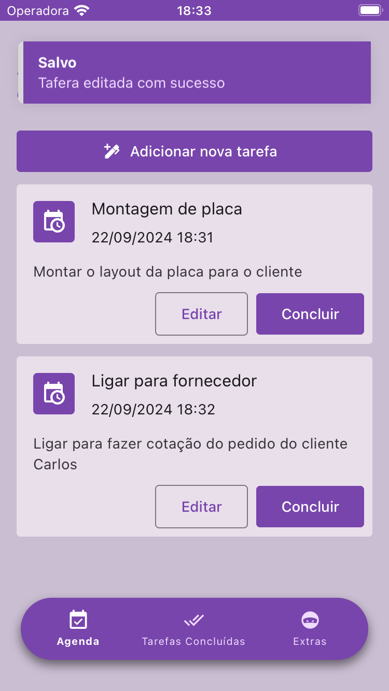
    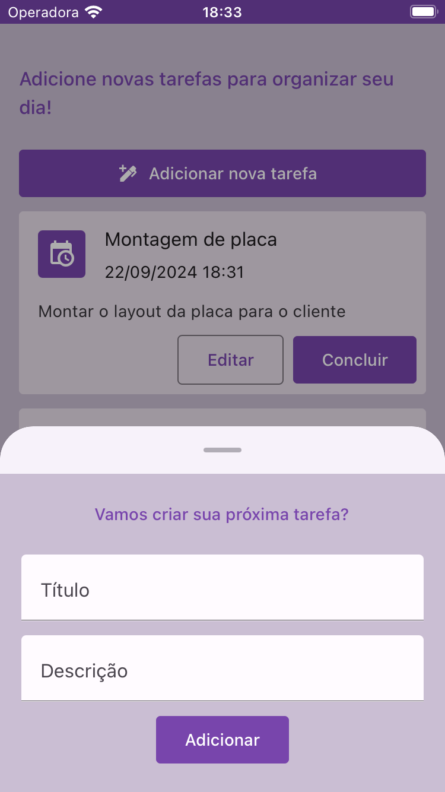
    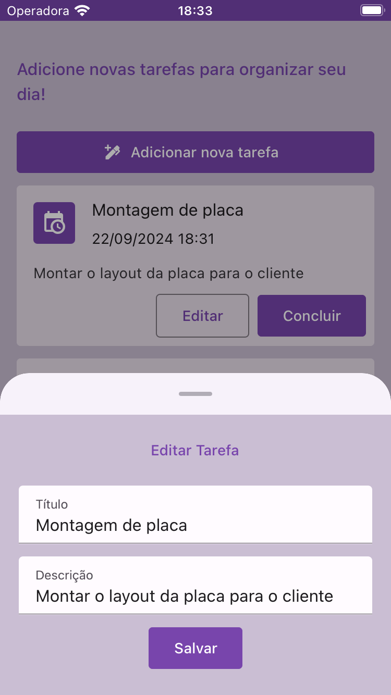
    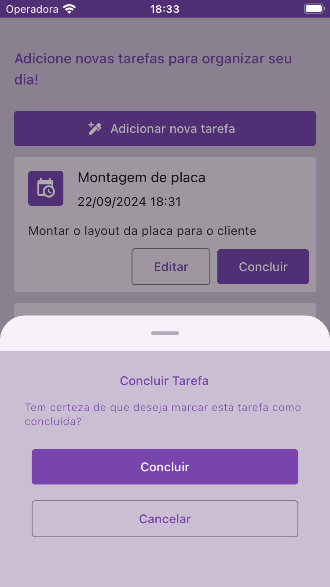
    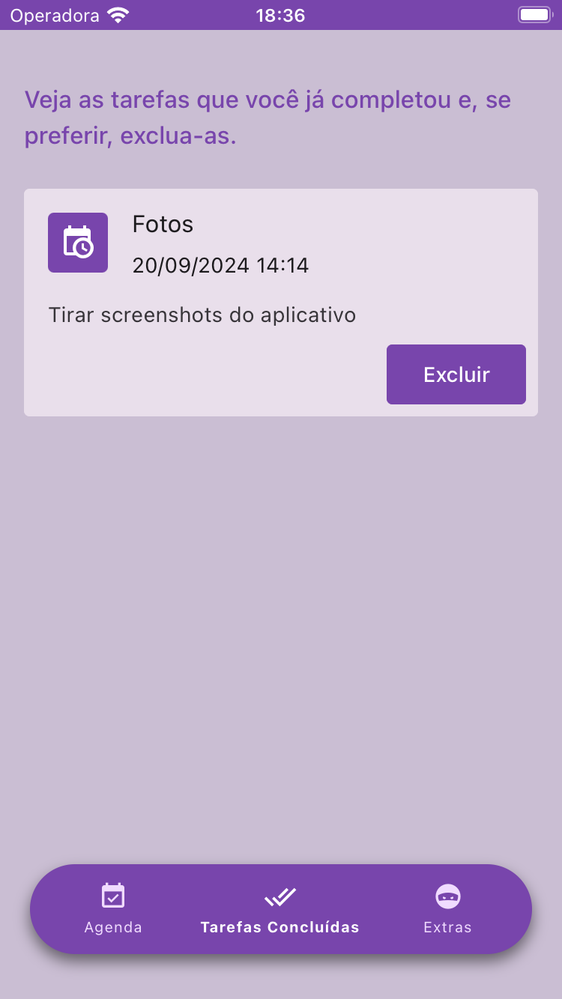
    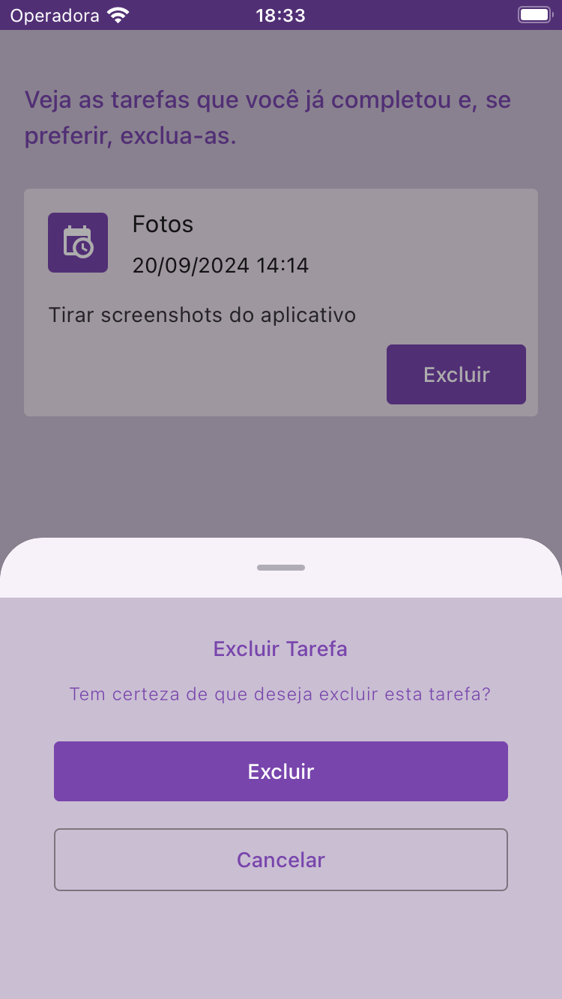
    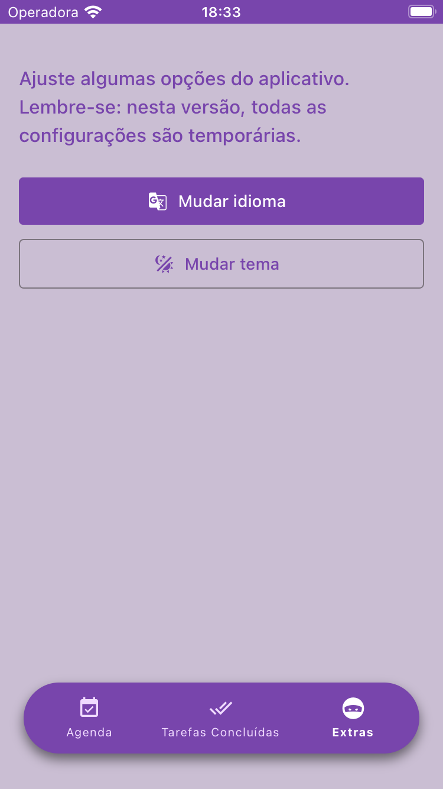
    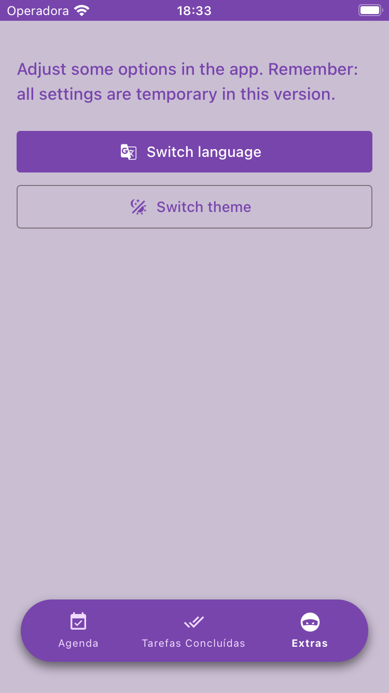
    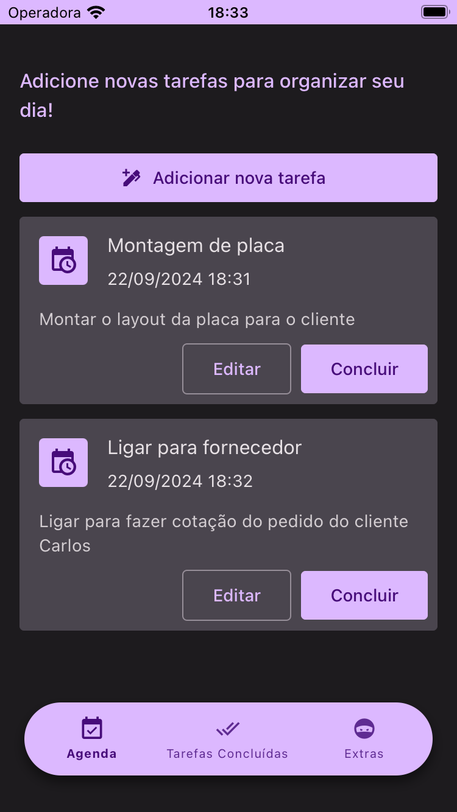
    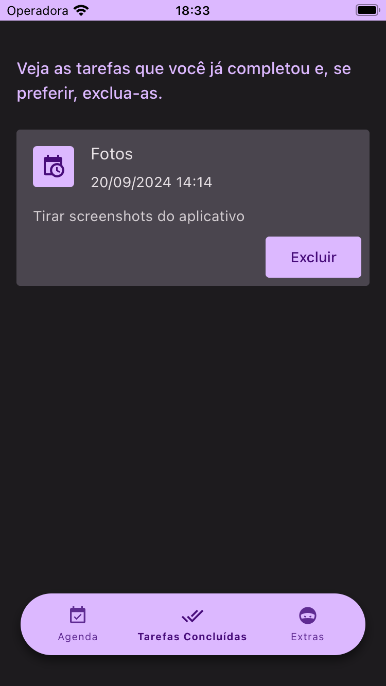
    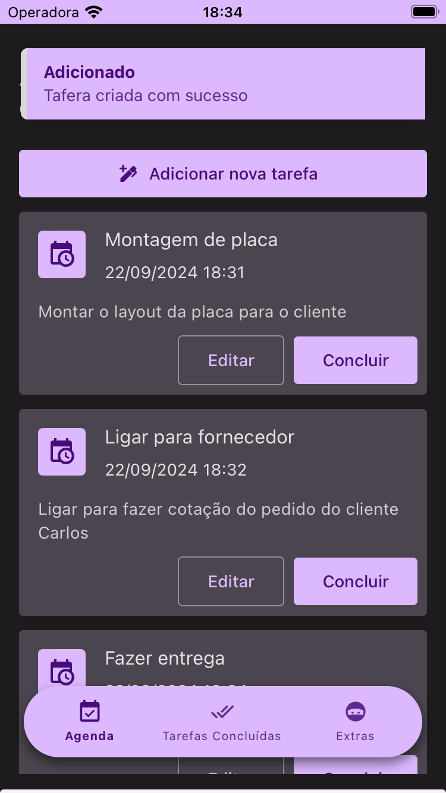
    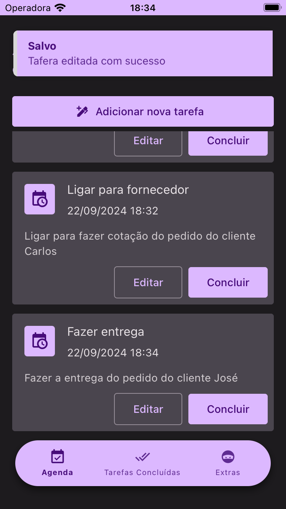
    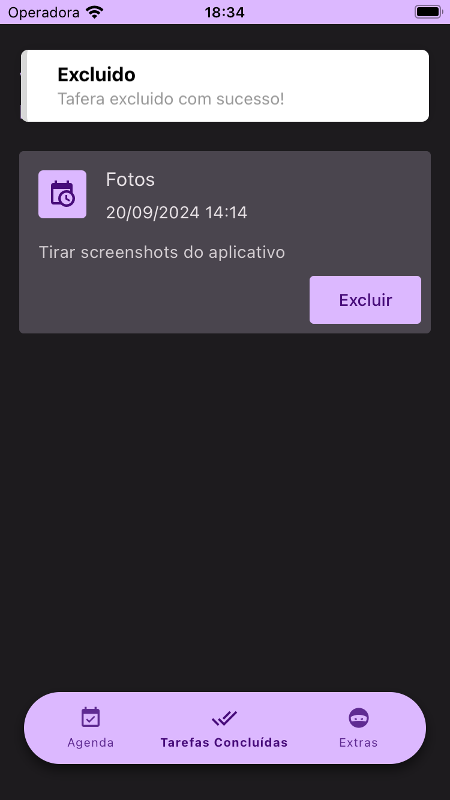
  </p>

</details>

<br>

<details>
  <summary>Ver vídeo</summary>

  [src/assets/movie/movie.gif](https://youtube.com/shorts/MgGHl7PxdQU?feature=share)
  
</details>

## Licença

Este projeto está licenciado sob a [MIT License](LICENSE).
